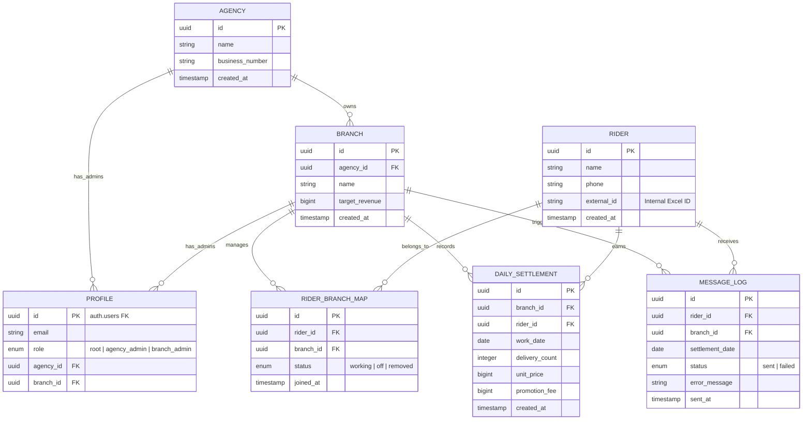

# RiderFlow ERD (v1.1)

## 핵심 관계 설명

1. 조직 계층: `AGENCY`는 여러 `BRANCH`를 가질 수 있으며, 사용자는 `PROFILE`을 통해 특정 본사나 지사에 귀속됩니다.
2. 라이더 관리: `RIDER` 정보는 고유하지만, `RIDER_BRANCH_MAP`을 통해 특정 지사에서의 상태(근무/휴무)를 관리합니다.
3. 정산 구조: `DAILY_SETTLEMENT`는 엑셀 업로드 시 생성되며, 지사와 라이더를 연결하는 핵심 트랜잭션 데이터입니다.
4. 매칭 로직: 엑셀 파싱 시 `RIDER` 테이블의 `name`, `phone`, `external_id` 필드를 사용하여 정확한 기사를 식별합니다.
