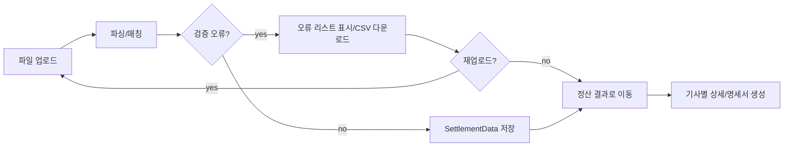

# RiderFlow PRD (v1 초안)

## 1. 개요

- 목적: 지사별 배달 라이더 정산을 웹으로 관리·시각화하고, 명세서(PDF/이미지) 생성까지 이어지는 운영 효율을 높인다.
- 대상 플랫폼: Web (React Router + Supabase + TailwindCSS).
- 로그인 사용자(1차): 본사 관리자, 지사 관리자, 회계/정산 담당자.
- 비로그인 사용자(1차): 라이더는 시스템에 계정/프로필로만 존재하며, 서비스 로그인/직접 열람 기능은 범위 밖.

## 2. 문제 정의

- 운영자는 매주 엑셀을 업로드하며, 포맷/필수 컬럼 누락/라이더 매칭 실패 같은 오류를 빠르게 식별해야 한다.
- 업로드 결과를 근거로 지표(총 건수/정산액)와 기사별 요약을 확인하고, 필요하면 명세서를 생성해야 한다.

## 3. 핵심 원칙(결정사항 반영)

- 엑셀 원본 파일은 저장하지 않는다. 파싱된 정산 데이터만 DB에 저장한다.
- 업로드 히스토리(파일 목록/업로드 건 내역)는 저장/제공하지 않는다.
  - 단, 업로드 직후 화면에서 "이번 업로드 세션"의 성공/실패/오류 리스트는 확인 가능해야 한다.
- 데이터 접근은 Supabase RLS로 `agency_id/branch_id` 스코프를 강제한다.

## 4. 1차 범위 (기능 요약)

- 대시보드: 요약 카드, Top 라이더, 기사별 최근 정산 테이블.
- 정산 업로드: XLS/XLSX 업로드, 파싱/매칭/검증, 오류 리스트 표시 및 다운로드(CSV).
- 정산 결과: 기간 기반 요약, 기사별 요약 목록, 필터(기간/기사/금액), PDF/엑셀 다운로드.
- 기사별 상세: 프로필, 기간별 그래프, 상세 테이블, 명세서 생성(PDF/이미지).
- 정산 내역(기간 기반): 파일 리스트가 아닌, 기간/기사/지사 기준으로 과거 정산 데이터를 조회.
- 기사 관리: 자동/수동 등록, 정보 수정, 소속 지사 연결(RiderBranchMap).
- 지사 설정: 프로필, 정산서 로고/컬러, 권한 관리, 기본 정산 공식(공제율 등).
- 알림센터: 발송 로그 조회(후순위로 “발송” 자체도 포함 가능).

## 5. 역할/권한(요약)

- 본사 관리자: 모든 지사/기사/정산 데이터 접근, 설정, 발송 로그 조회.
- 지사 관리자: 소속 지사 범위 내 업로드/조회/다운로드, 기사 관리, 지사 설정.
- 회계/정산 담당자: 업로드/검증/조회/다운로드 중심(설정 권한은 제한 가능).

## 6. 용어

- Rider(기사/라이더): 정산 대상자 엔티티. 1차에서는 로그인 주체가 아님.
- SettlementData(정산 라인 아이템): 엑셀에서 파싱된 “한 줄”의 정산 데이터.
- 현재 ERD의 `SettlementData`가 이 역할을 수행한다(대부분 work_date가 있는 일자별 행).
- Payslip(명세서): 기간(주간)을 기준으로 SettlementData을 집계하여 생성한 결과물(PDF/이미지).

## 7. UX 내비게이션 (React Router)

```text
/login
/dashboard
  /dashboard/upload
  /dashboard/results
  /dashboard/riders
  /dashboard/riders/:riderId
  /dashboard/history
  /dashboard/settings
  /dashboard/notifications
```

- `/dashboard/history`: 업로드 파일 내역이 아니라 “기간 기반 정산 내역 조회”로 정의한다.
- 대시보드 하위는 중첩 라우트로 공용 레이아웃(헤더/사이드바)을 공유한다.

## 8. 주요 사용자 플로우

### 8.1 정산 업로드 → 검증 → 결과 확인



### 8.2 명세서 생성(후순위로 발송 확장)

```mermaid
flowchart LR
query[기간(주간) SettlementData 조회] --> group[주간 그룹핑]
group --> payslip[PayslipGenerated 생성]
payslip --> store[이미지/PDF 저장(옵션: Storage)]
store --> notifCenter[알림센터에서 상태 조회]
```

## 9. 기능 요구 상세 (v1)

### 9.1 대시보드 `/dashboard`

- 요약 카드: 총 배달 건수, 총 정산액, 기사 수, 미생성 명세서 수.
- Top 라이더: 수익 내림차순 상위 N(기본 5), 클릭 시 기사 상세 이동.
- 기사별 최근 정산 테이블: 정렬(수익/건수), 검색(이름/전화), 페이지네이션, 상세 이동.
- “최근 업로드 파일” 섹션은 제공하지 않는다(업로드 히스토리 미저장).

### 9.2 정산 업로드 `/dashboard/upload`

- 입력: Drag&Drop 및 파일 선택(XLS/XLSX).
- 진행 상태: 업로드 → 파싱 → 매칭 → 검증 → 저장.
- 매칭: 라이더ID/이름/전화번호 기반(정책은 지사별로 우선순위 설정 가능).
- 검증(최소):
  - 필수 컬럼: `work_date`, `delivery_count`, `delivery_fee` 등(PRD 템플릿으로 명시).
  - 타입/범위 체크: 날짜 파싱, 금액/건수 음수 여부, total_pay 음수 여부.
  - 매칭 실패: 라이더를 찾지 못한 행은 실패로 분류하고 원인을 제공.
- 결과 표시(세션 기반):
  - 성공/실패 건수, 실패 사유별 카운트.
  - 실패 행 리스트를 CSV로 다운로드.
  - “재업로드” 및 “정산 결과로 이동” CTA 제공.

### 9.3 정산 결과(요약) `/dashboard/results`

- 요약 지표: 총 건수/정산액/라이더 수.
- 필터: 기간(필수), 기사, 금액 범위.
- 다운로드: PDF/엑셀(기간/필터 기준).
- 기사별 상세로 이동 링크.

### 9.4 기사별 정산 상세 `/dashboard/riders/:riderId`

- 프로필: 이름, 전화번호, 소속 지사(활성 매핑).
- 기간별 그래프: 정산액/건수 추이.
- 상세 테이블: SettlementData 기반 컬럼 렌더링 및 정렬/필터.
- 액션: 명세서 생성(PDF/이미지) 및 다운로드.

### 9.5 정산 내역(기간 기반) `/dashboard/history`

- 목적: “과거 정산 데이터”를 기간/기사/지사 조건으로 조회한다(업로드 파일 단위 내역 아님).
- 제공 기능:
  - 기간 필터(주/월/임의 구간)
  - 검색/정렬/페이지네이션
  - 결과 다운로드(PDF/엑셀)

### 9.6 기사 관리 `/dashboard/riders`

- 등록: 업로드 시 신규 라이더 자동 등록 + 수동 등록.
- 편집: 이름/전화 등 기본 정보 수정.
- 연결: RiderBranchMap 관리(active/inactive).

### 9.7 지사 설정 `/dashboard/settings`

- 지사 프로필: 이름, 지역.
- 명세서 테마: 로고/컬러 저장(명세서 생성 시 적용).
- 권한 관리: 본사/지사/회계 롤 부여(초대/삭제 정책은 추후 상세화).
- 정산 공식: 공제율/위험부담금 등 기본값 저장(집계 로직에서 사용).

### 9.8 알림센터 `/dashboard/notifications` (로그 중심)

- 데이터: MessageLog(성공/실패, 응답코드, 이미지 URL, 발송 시각).
- 기능: 기간/상태 필터, 페이지네이션.
- 재발송/발송 트리거는 후순위.

## 10. 데이터/ERD 매핑 (Supabase)

- 테이블: Agency, Branch, BranchManager, Rider, RiderBranchMap, SettlementData, PayslipGenerated, MessageLog, KakaoProfile(옵션).
- PRD 용어 매핑: `SettlementData` = SettlementData(정산 라인 아이템).
- 핵심 흐름: SettlementData(=SettlementData)을 기간(주간)으로 그룹 → PayslipGenerated 생성 → (후순위) MessageLog 기록.

## 11. 인증/보안 요구

- 인증: 관리자만 Supabase Auth로 로그인(이메일/비밀번호).
- 권한: RLS로 `branch_id/agency_id` 스코프를 강제.
- 관리자 프로필(예: BranchManager)은 Supabase Auth 사용자와 매핑되는 앱 테이블로 관리하며, 비밀번호/해시는 DB에 별도 저장하지 않는다.
- Rider 데이터는 로그인과 분리된 엔티티로 관리(조회/편집 권한은 관리자 역할에 한정).

## 12. 기술 요구

- 프런트: React Router(중첩 라우트), Tailwind UI.
- 데이터: Supabase Query 중심(필요 시 React Query 도입).
- 서버: Edge Functions로 XLS/XLSX 파싱/검증/적재. 원본 파일 저장 없음.
- 명세서: (후순위 포함) 생성물 저장이 필요하면 Supabase Storage 사용.

## 13. 비기능 요구

- 성능: 업로드 5MB 기준 파싱/검증 30초 내, 대시보드 주요 쿼리 1초 내 목표.
- 접근성: 키보드 네비게이션, 색 대비 준수.
- 감사/추적: 업로드 히스토리는 미저장이나, 정산 데이터의 생성 시각/소속 지사 기준으로 최소 추적 가능해야 한다.

## 14. 성공 지표 (예시)

- 업로드→검증 완료까지 평균 처리 시간
- 검증 실패율(매칭 실패/형식 오류 비율)
- 명세서 생성 성공률 및 평균 생성 시간

## 15. 오픈 이슈(향후)

- 업로드 건 단위 감사/재처리가 필요해지면 `SettlementDataUpload` 같은 메타 테이블 도입 검토(현 v1 범위 제외).
- 알림톡 발송(Kakao Biz) 연동의 키/비용/템플릿 확정.
- PDF/차트 라이브러리 선택 및 명세서 포맷 확정.
